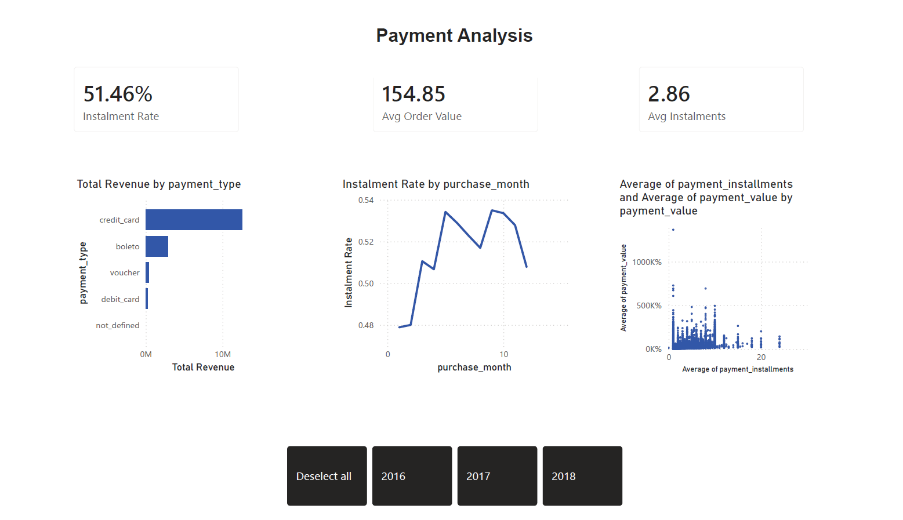
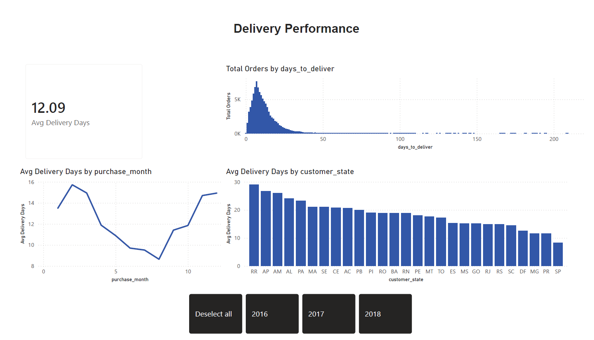

# 💳 Payments BI Dashboard — Riverty-Style Financial Analytics


A 3-page interactive Power BI dashboard analysing **100,000+ real e-commerce payment transactions**, built to demonstrate BI self-service skills relevant to FinTech payment analytics — modelled after the kind of reporting used at companies like Riverty (Bertelsmann Group).

---

## 📊 Dashboard Preview

### Page 1 — Executive Overview


### Page 2 — Payment & BNPL Analysis


### Page 3 — Delivery Performance


---

## 📈 Key Insights

| Metric | Value |
|---|---|
| Total Revenue | $15.99M |
| Total Orders | 99K |
| Delivery Success Rate | 97.02% |
| Avg Review Score | 4.09 / 5 |
| Instalment Rate (BNPL) | 51% |
| Avg Order Value | $154.85 |
| Avg Delivery Time | 12.09 days |
| Credit Card Share | 78.42% of revenue |

---

## 📋 Dashboard Pages

### Page 1 — Executive Overview
- Total Revenue, Orders, Delivery Rate and Review Score KPI cards
- Monthly revenue trend by year (2016–2018)
- Revenue breakdown by payment type (credit card dominates at 78%)
- Order volume by fulfilment status
- Interactive year slicer synced across all pages

### Page 2 — Payment & BNPL Analysis
- Instalment Rate: **51%** of orders use instalments — core BNPL insight
- Revenue by payment type: credit card, boleto, voucher, debit card
- Instalment rate trend across months showing seasonal patterns
- Payment value vs instalment count scatter analysis

### Page 3 — Delivery Performance
- Delivery time histogram — peak at 5–10 days with long tail to 200 days
- Monthly delivery trend revealing summer dip (months 6–8)
- Geographic breakdown across all 27 Brazilian states: **RR at 29 days vs SP at 9 days**

---

## 🗂️ Data Model — Star Schema

```
fact_orders ──── dim_customers
     │
     ├────────── fact_payments
     │
     ├────────── fact_items ──── dim_products
     │                    └──── dim_sellers
     │
     └────────── dim_reviews
```

**3 Fact Tables:** `fact_orders`, `fact_payments`, `fact_items`  
**4 Dimension Tables:** `dim_customers`, `dim_products`, `dim_sellers`, `dim_reviews`

---

## 🧮 Key DAX Measures

```dax
Total Revenue = SUM(fact_payments[payment_value])

Delivery Success Rate =
FORMAT(DIVIDE([Delivered Orders], [Total Orders], 0), "0.00%")

Instalment Rate =
FORMAT(DIVIDE([Instalment Orders], [Total Orders], 0), "0%")

Revenue YoY Growth =
VAR CurrentYear = CALCULATE(SUM(fact_payments[payment_value]))
VAR PrevYear = CALCULATE(SUM(fact_payments[payment_value]),
               SAMEPERIODLASTYEAR(fact_orders[order_purchase_timestamp]))
RETURN DIVIDE(CurrentYear - PrevYear, PrevYear, 0)

Avg Delivery Days = AVERAGE(fact_orders[days_to_deliver])

Avg Order Value = AVERAGE(fact_payments[payment_value])
```

---

## ⚙️ ETL Pipeline (Python)

Raw Kaggle CSVs → cleaned with `pandas` → exported as star schema → imported into Power BI Desktop

```
Raw (8 tables)                 Clean Star Schema (7 tables)
──────────────                 ────────────────────────────
olist_orders_dataset      ───► fact_orders.csv
olist_order_payments      ───► fact_payments.csv
olist_order_items         ───► fact_items.csv
olist_customers           ───► dim_customers.csv
olist_products            ───► dim_products.csv
olist_sellers             ───► dim_sellers.csv
olist_order_reviews       ───► dim_reviews.csv
```

**Key transformations:**
- Date parsing and feature engineering (`days_to_deliver`, `purchase_year`, `purchase_month`, `purchase_quarter`)
- Null handling for product categories
- Binary flag: `is_installment` (1 if installments > 1)
- Computed: `total_item_value = price + freight_value`

---

## 🛠️ Tech Stack

| Tool | Purpose |
|---|---|
| Power BI Desktop | Dashboard, DAX measures, star schema modelling |
| Python (pandas) | ETL pipeline, data cleaning, CSV export |
| DAX | KPI measures, YoY growth, rate calculations |
| Star Schema | Optimised relational data model (3 fact + 4 dim) |

---

## 📁 Repository Structure

```
riverty-style-payments-bi-dashboard/
├── etl_pipeline.py                  # Python ETL: raw → star schema
├── olist_payments_dashboard.pbix    # Power BI dashboard file
├── page1_executive.png.png          # Executive Overview screenshot
├── page2_payments.png.png           # Payment Analysis screenshot
├── page3_delivery.png.png           # Delivery Performance screenshot
└── README.MD
```

---

## 📦 Dataset

**Brazilian E-Commerce Public Dataset by Olist**  
Source: [Kaggle — olistbr/brazilian-ecommerce](https://www.kaggle.com/datasets/olistbr/brazilian-ecommerce)  
100,000 orders | 2016–2018 | 8 relational tables | ~5MB

---

## 👤 Author

**Gaurav Bhatia**  
MSc Data Science, AI & Digital Business — GISMA University, Berlin  
[LinkedIn](https://linkedin.com/in/gaurav-bhatia-5a5a83184) | [GitHub](https://github.com/gauravbhatia-bit)
